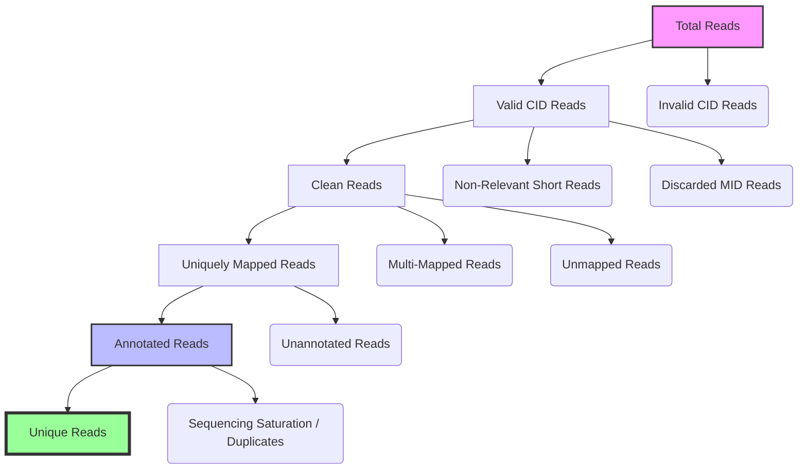

---
{"publish":true,"created":"2025-12-08T18:43:03.182+08:00","modified":"2026-01-06T21:30:11.813+08:00","cssclasses":""}
---

## 测序仪：Reads 本身是否可靠？

### Per-base Quality

测序质量在 reads 末端不可避免会下降。随着测序循环（Cycle）的增加，酶活性降低，簇信号（Cluster signal）的相位模糊（Phasing/Pre-phasing）累积，导致信噪比下降。我们接受末端的适度下降，但警惕大面积的低质量区（Q20 以下）。这通常意味着测序仪流道（Flowcell）本身的问题或严重的试剂耗尽。

### GC Content

理论上，一个随机打断、高质量的基因组文库，其 GC 含量分布应近似于目标物种基因组的平均 GC 含量，呈单峰且相对对称。如果出现双峰或锯齿状分布，这在数学上很难用“随机取样”解释，往往指向了非预期的文库混合或外源污染（例如，细菌污染或接头二聚体）。

### Adapter Content

如果插入片段（Insert Size）过短或上样浓度过高，测序仪会读通片段并继续读入接头（Adapter）序列。我们通过观察接头含量在 read 尾部的上升趋势来判断这是否发生。明显上升，尤其是在 read 尾部，说明需要更严格的 Trimming 处理。

> [!INFO] FastQC
> 
> 直接对 FASTQ 文件进行统计，不依赖参考基因组。Fastqc是为了识别测序过程的系统性噪声（Systematic Noise）。
> 
> 判读标准摘要：
> 
> - Per-base Quality：绝大部分碱基需在高质量区间。不合格迹象是出现大面积低于 Q20 的区域。
> - GC Content：应为单峰且接近物种参考分布。多峰或明显偏离物种分布则不合格。
>     

## Mapping：Reads 是否来自正确的来源？

排除了测序仪本身的故障后，我们接下来关注 Reads 是否成功映射到了预期的参考基因组。这阶段的噪声主要来自比对算法（如 STAR）与参考基因组之间的相互作用。

### Mapping Rate

一个健康的 RNA-seq 样本，其整体 Mapping Rate 通常应该在 80% 以上。低 Mapping Rate（例如远低于 70%）是信号衰减的明确标志，常见于以下几种情况：严重的污染、RNA 降解（导致片段化过于严重）、或使用了错误的版本或物种的参考基因组。

### Unique vs. Multi-mapping

Reads 可以被唯一比对（Unique Mapping）到基因组的一个位置，也可以比对到多个位置（Multi-mapping）。Multi-mapping 的 Reads 通常是由于它们来自重复序列区域（如线粒体 NUMTs 或基因家族）。

- 逻辑判断：Unique Mapping 的比例越高越好，因为它代表了更高的信息分辨率。Multi-mapping 异常升高，尤其是当非重复区域的覆盖度没有显著增加时，需要警惕文库质量问题或严重的序列富集偏差。

> [!NOTE]
> multi-mapping不总是代表样本质量差, 异常重复的gene例如线粒体gene, multi mapping是正常的.

### Mismatch Rate

Mismatch Rate（比对时的碱基不匹配比例）反映了比对的精度。它通常应较低且稳定。如果 Mismatch Rate 明显升高，可能暗示着较高的测序错误率、样本间的污染、或物种与参考基因组之间存在显著的遗传差异。

> [!SUMMARY] STAR
> 
> 基于高效的 seed-and-extend 算法，利用后缀数组进行快速比对。能确定 Reads 是否真正来自预期的转录本区域。
> 
> 判读标准摘要：
> - Mapping Rate：合格通常 $>80\%$。
> - Unique/Multi-mapping：Unique Mapping 应占主导地位。
>     

---

## 文库构建：是否过度扩增与结构异常？

从比对结果中，我们可以反推文库构建过程的健康程度。这部分噪声主要与 PCR 扩增和片段化有关，由 Picard 或 FastQC 的部分指标揭示。

### Duplication Rate/duplication rate

Duplication Rate 衡量的是文库中来自同一个RNA分子重复序列的比例。在 RNA-seq 中，这通常是由于文库复杂度不足（起始 RNA 量过低）或 PCR 循环过多导致的。

$$
\begin{align*}
\text{duplication rate} = \frac{\text{Number of Duplicate Reads}}{\text{Total Mapped Reads}}  = \\
\text{saturation rate} = 1 - \frac{\text{n unique UMI}}{\text{n total valid reads}}

\end{align*}
$$
> [!NOTE]
> 重复序列本身不会带来错误信息，但它们会降低测序的有效信息量。

高达 $70\%$ 以上的重复率往往意味着文库量严重不足或扩增过度，应当被视为不合格。适中的重复率（如 $20\%-50\%$）在真核生物样本中较为常见。

> [!NOTE] 测序深度是否足够? 
> saturation必须从mapping的输出bam文件中计算得到, 通过模拟抽样不同比例read, 统计相应unique UMI可以绘制一条 saturation-n_reads 曲线, 如果该曲线最后的趋势相对平缓,则说明继续测序深度对于得到更多unique UMI无太大贡献. 当saturation接近1时,说明绝大多数read都是在重复测量.
> 
> 仅仅从count matrix不足以计算saturation.
> 举例来说
> - PCR重复扩增UMI在count matrix只会被计数一次
> - 未比对到gene的read的信息也被丢弃了,
> - 多次比对和其他异常比对到genome的read也会被丢弃

> [!QUESTION] 总read数量和UMI数量能否得到saturation plot
> 在QC report提供的是总read数量和总UMI数量, 但是由于不知道每个UMI相应的read占比(UMI对应read的分布情况) 这不足以重新绘制saturation plot
> 除非假定例如UMI的分布, 例如UMI对应read服从均匀分布, 但是read扩增具有偏好性, 一般不满足均匀分布
> 
> 但是可以计算相应的saturation rate, 由于分布未知, 无法推测继续增加测序深度是否能够继续捕捉更多分子UMI
> 存在两种极端情况:
> 1. UMI对应read数量服从均匀分布, 增加测序深度将会继续以斜率增加分子UMI数量
> 2. UMI对应read数量极端不均衡, 继续增加测序深度收益非常小, 甚至为0

> [!NOTE] 不使用UMI测序技术 的saturation rate
> 在不使用UMI的测序技术里(例如bulkRNAseq, 起始量高) 我们使用mapping到相同位置的reads视为duplicate, 因为无法根据UMI区分表达量差异和PCR扩增差异, duplication rate过高是一件坏事.
> 在使用UMI的测序技术(例如scRNAseq, 起始量低信号依赖PCR扩增)因为可以区分真实分子和PCR扩增产物, 这里我们可以真实区分来自同一个分子的duplicate, 从而进行判断UMI分子池子是否被捞干净: 继续增加测序深度, UMI的上升情况 

### Insert Size Distribution

插入片段长度分布（Insert Size Distribution）是评估文库片段化和筛选稳定性（通常在凝胶或磁珠分选后）的关键指标。一个健康的文库应该呈现一个单峰且峰值符合试剂盒预期长度（如 $200-500\text{ bp}$）的分布。多峰或过短的分布可能说明片段化不足或样本降解导致片段过小。

### Overrepresented Sequences

FastQC 还会报告高频出现的序列。在多数情况下，高频序列能被解释为 rRNA、接头残余或其他技术序列。如果单一的未知序列占比异常高（如 $>1\%$），且无法解释为已知的污染物，则需排查库建过程的系统性偏差。

> [!TIP] Picard
> 
> Picard 将来自相同基因组位置、且具有相同起始坐标的 Reads 标记为 PCR Duplicates。
> 
> 隐含代价：高 Duplication Rate 意味着我们在测序上花费了更多来获取冗余信息。在差异表达分析中，这些重复序列通常只计数一次。(注意: duplicates和来自同一gene的不同read不同, duplicates对于表达量差异没有贡献)

---

## 生物样本：RNA 是否完整、是否降解？

这部分噪声与测序或建库技术无关，而是由生物样本本身的物理状态带来的，主要通过 RSeQC 提供的指标进行诊断。

### Gene Body Coverage

Gene Body Coverage 是诊断 RNA 降解的黄金标准。在一个理想的、高质量的 mRNA 文库中，Reads 应该均匀地覆盖整个转录本的长度（从 $5'$ 端到 $3'$ 端）。

如果曲线明显倾斜，在 $5'$ 端覆盖急剧下降，而 $3'$ 端覆盖相对完整，这几乎可以确定地表明 RNA 发生了降解。这是因为 Poly-A 捕获的文库是从 $3'$ 端开始反转录的，降解会使 $5'$ 端片段缺失。

### Read Distribution

Reads 在 UTR、CDS、内含子（Intron）等基因结构中的分布，反映了文库的链特异性策略与质量。例如，如果采用的是 Poly-A 捕获，大部分 Reads 理应落在 CDS 和 $3'$ UTR 区域。大量 Intronic Reads 或不合理的分布，可能暗示着严重的 gDNA 污染或非 Poly-A RNA（如 rRNA）残留。

### Strand Inference

Strand Inference（链方向推断）至关重要。通过检查 Reads 的比对方向与注释基因的链方向的关系，我们可以确定文库是否具备链特异性。

合格的链特异性文库，某一类方向的 Reads 占比应 $>90\%$。如果分布约为 $50:50$，则说明文库是 Unstranded，这会影响后续 featureCounts / Salmon 等定量工具的参数设置。

---

## 实验设计：样本能否作为整体进行分析？

最后，我们不再关注单样本的质量，而是将所有样本作为一个整体来审视：它们之间的变异是否主要由我们的实验设计决定？ 这通常通过 PCA（主成分分析） 和样本距离矩阵来评估。

### PCA (Principal Component Analysis)

PCA 将高维的表达矩阵投影到低维平面，旨在揭示数据中变异的主要来源。

- 合格信号：同组样本聚得较近，实验组间的分离是 PC1 或 PC2 的主要解释来源。
- 噪声信号：如果样本是按批次、测序日期、或不同操作员聚类，而非实验处理，则这强烈的批次效应（Batch Effect）必须通过统计方法进行校正，否则会干扰后续的差异分析。

### 样本距离矩阵

样本距离矩阵（基于 VST 或 rlog 转换后的表达矩阵）直观地展示了样本之间的相似度。

组内距离应小于组间距离。如果某些样本与所有其他样本都距离遥远，或者一个本应与同组样本靠近的样本却偏向另一组，这表明该样本可能是异常值（Outlier），需要进一步排查其生物学或技术原因。

---

## 总结

MultiQC 报告并非一张简单的“指标列表”，而是一个用于描绘数据生成过程中每一层可能偏差的诊断工具。

### read按照层次分类

每个read读段按照 if valid CellID/if high quality/if unique mapped/if annotated/if duplicated 可以进行如下分类

> [!NOTE] TODO
> 在许多其他组学技术中（如 ChIP-seq, ATAC-seq）中的质量报告
> 

> [!NOTE] 实际项目中的十分钟流程
> 
> 实际工作中，我们通常遵循一个自上而下的流程：
> 1. 快速检查：看 PCA 和 Sample Distance。如果样本分组混乱，优先解决批次效应问题。
>     
> 2. 比对结果：查看 Mapping Rate。如果过低，直接检查 FastQC 原始质量。
>     
> 3. 文库质量：查看 Gene Body Coverage 和 Duplication Rate。这两个指标决定了数据的可信度与深度。
>     
> 4. 细节排查：只有前三个检查出现问题时，才深入查看 GC 含量、Adapter Content 等细节图。

## reference

[[为什么使用nextflow]] nf-core rnaseq multiqc-report
