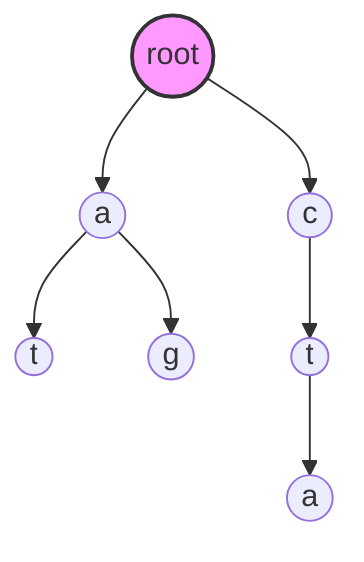
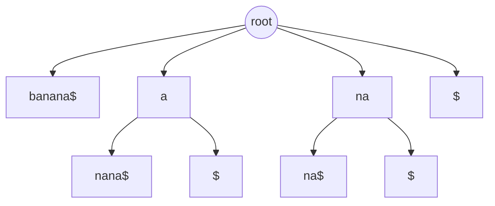

---
{"publish":true,"created":"2025-11-24T10:37:54.000+08:00","modified":"2025-12-09T21:48:36.821+08:00","tags":["BWT"],"cssclasses":""}
---

## Read Mapping challenge

在生物信息学中，Read mapping（序列比对）是将测序仪产生的原始数据向基因组比对, 这是解释转录read的前提。

这里存在一个极端的规模不对称：
- **输入 (Reads)**：数百万甚至数十亿条短序列，每条长度通常在 100-300 bp 之间。
- **参考 (Reference)**：如人类基因组，长度约为 30 亿 ($3 \times 10^9$) 个碱基。

如果采用传统的动态规划（如 Smith-Waterman 算法），将每一条 Read 与基因组进行全长比对，其时间复杂度为 $O(nm)$。在如此巨大的数据规模下，这种计算量是完全不可接受的。

Read mapping 的本质问题，可以抽象为字符串匹配问题：

> “如何在巨大的参考文本 $T$ 中，快速找到查询串 $P$ 所有可能的出现位置？”

为了解决这个问题，算法设计的思路发生了从“扫描文本”到“查询索引”的范式转移。

---

## Trie（前缀树）

### 形式化说明

Trie 是一种有序树数据结构。给定一个字符串集合 $S$，Trie 满足以下性质：
- 根节点不包含字符，除根节点外的每个节点都只包含一个字符。
- 从根节点到某一节点，路径上经过的字符连接起来，为集合 $S$ 中某个字符串的前缀。

### 直观理解

Trie 将公共前缀合并，极大地减少了存储空间和查询时间。它非常适合处理“固定模式集合”的匹配（例如在英语词典中查找单词），查询时间仅与查询词的长度有关 $O(|P|)$，而与字典大小无关。

### 例子说明

假设我们有模式集合 $S = \{\text{at, ag, cta}\}$。

构建的 Trie 结构如下：



### 代码实现

这是一个最简的 Python 实现，用于理解树的构建：

```Python
class TrieNode:
    def __init__(self):
        self.children = {}
        self.is_end = False

class Trie:
    def __init__(self):
        self.root = TrieNode()

    def insert(self, word):
        node = self.root
        for char in word:
            if char not in node.children:
                node.children[char] = TrieNode()
            node = node.children[char]
        self.is_end = True

    def search(self, word):
        node = self.root
        for char in word:
            if char not in node.children:
                return False
            node = node.children[char]
        return True # 这里简化处理，仅判断前缀是否存在
```

> [!NOTE] 局限性
> 
> Trie 擅长查找完整字符串或前缀。但在 Read mapping 中，Read 可能匹配到基因组的任意位置（即基因组的任意子串）。如果直接用 Trie，我们需要将基因组所有可能的子串都插入树中，这在空间上是不可行的。

## Suffix Tree

### 动机

为了解决“任意子串匹配”问题，我们引入后缀的概念。

> [!NOTE]
> 文本 $T$ 的任意子串，必然是 $T$ 的某个后缀的前缀。

给定文本 $T$（长度为 $n$），其后缀集合定义为：

$$Suf(T) = \{ T[i:n] \mid 0 \le i < n \}$$

后缀树是 $Suf(T)$ 的压缩 Trie（Compressed Trie）。“压缩”意味着将没有分支的单路径节点合并，使得每条边可以标记一个字符串序列。

#### 直观理解

既然子串是后缀的前缀，如果我们把所有后缀都插入一个 Trie，那么判断 $P$ 是否在 $T$ 中出现，就等同于判断 $P$ 是否为该 Trie 的某个前缀。这将搜索复杂度严格控制在 $O(|P|)$。

### 例子

以文本 $T = \text{banana\$}$ 为例。

其后缀包括：banana$, anana$, nana$, ana$, na$, a$, $。

构建的部分后缀树（为了直观，展示逻辑结构）如下：



> [!NOTE]
> 实际后缀树中，边存储的是索引范围而非完整字符串)

### 实现

```Python
def get_suffixes(text):
    """生成所有后缀"""
    # 0-based, 左闭右开
    return [text[i:] for i in range(len(text))]

# 示例
text = "banana$"
suffixes = get_suffixes(text)
# 结果: ['banana$', 'anana$', 'nana$', 'ana$', 'na$', 'a$', '$']
# 后缀树即为这些字符串构成的压缩 Trie
```

> [!INFO] 后缀树应用于人类基因组? 内存不足
> 
> 后缀树虽然完美解决了搜索时间问题，但付出了巨大的空间代价。由于通过大量的指针连接节点，其空间消耗通常是原文本大小的 20 到 50 倍。对于 3GB 的人类基因组，这意味着需要上百 GB 的内存，这在早期的生物计算中是昂贵的。

---

## Suffix Array

为了移除后缀树昂贵的指针结构，我们转向后缀数组（SA）。
$SA$ 是一个整数数组，存储了 $T$ 的所有后缀按字典序排序后的起始索引。

满足：

$$T[SA[i]:] < T[SA[i+1]:]$$

### 直观理解

$SA$ 本质上是后缀树的所有叶子节点，按照从左到右的顺序排列。它去掉了树的内部节点和边，只保留了最核心的排序信息。通过二分查找，我们可以在 $O(|P| \cdot \log n)$ 时间内找到 $P$。

### 例子

$T = \text{banana\$}$

|**i**|**Index**|**Suffix**|
|---|---|---|
|0|6|$|
|1|5|a$|
|2|3|ana$|
|3|1|anana$|
|4|0|banana$|
|5|4|na$|
|6|2|nana$|

此时 $SA = [6, 5, 3, 1, 0, 4, 2]$。

### 代码实现

朴素构造法（非 $O(n)$，仅供理解）：

```Python
def build_sa(text):
    n = len(text)
    # 生成 (suffix, index) 的元组列表
    suffixes = [(text[i:], i) for i in range(n)]
    # 按后缀字典序排序
    suffixes.sort() 
    # 提取排序后的原始索引
    sa = [item[1] for item in suffixes]
    return sa

text = "banana$"
sa = build_sa(text)
print(f"SA: {sa}")
```

### LCP (Longest Common Prefix)

为了加速二分查找，我们通常结合 LCP 数组。

$$LCP[i] = \text{length of common prefix between } T[SA[i]:] \text{ and } T[SA[i-1]:]$$

这相当于后缀树中相邻叶节点的“最低公共祖先”深度。有了 LCP，我们可以跳过大量重复字符的比对。

## Burrows-Wheeler Transform

后缀数组将内存降低到了文本的 4-8 倍（取决于整数位宽），但对于海量数据仍有改进空间。

BWT 的出现是一个转折点，它最初用于数据压缩，后来发现天然支持高效搜索。

### BWT 的构造


令 $M$ 为文本 $T$ 的所有循环移位（Rotations）组成的矩阵。将 $M$ 的行按字典序排序。

BWT 字符串 定义为排序后矩阵的最后一列 (L列)。

#### 直观理解

排序是基于“前缀”进行的（即矩阵的第一列）。

因此，矩阵的每一行 $i$，其最后一列字符 $L[i]$ 正是第一列字符 $F[i]$ 在原文本中的前一个字符。

由于具有相似前缀的后缀排列在一起，它们的前一个字符往往也是相同的（基于文本的局部相关性）。这导致 BWT 串中出现大量的连续重复字符（Runs）。

#### 例子

$T = \text{banana\$}$

1. **列出轮转** $\to$ 2. **排序** $\to$ 3. **取最后一列**
    

|**Sorted Rotations (M)**| r                |
|---|---|
|**$** banana| $\to$ **L[0]=a** |
|**a** $banan| $\to$ **L[1]=n** |
|**a** na$ban| $\to$ **L[2]=n** |
|**a** nana$b| $\to$ **L[3]=b** |
|**b** anana$| $\to$ **L[4]=$** |
|**n** a$bana| $\to$ **L[5]=a** |
|**n** ana$ba| $\to$ **L[6]=a** |

得到 $BWT = \text{annb\$aa}$。

### BWT 为什么会压缩？

观察上面的例子，原始序列 `banana$` 没有明显连续字符，但 BWT 后的 `annb$aa` 出现了 `nn` 和 `aa` 的聚集。这种聚集使得 Run-Length Encoding (RLE) 等算法非常高效。

#### 什么时候会失效?

并非所有文本都能被 BWT 有效“聚类”。

$T = \text{abcdefg\$}$

排序后的轮转矩阵几乎是随机错开的，BWT 结果为 g$abcdef。没有任何连续字符，压缩收益为零。这说明 BWT 依赖于文本本身的重复结构。

#### 为什么 DNA 适合 BWT？

DNA 序列是 BWT 的绝佳应用场景：

1. **字母表小**：只有 A, C, G, T 四种字符。
2. **重复结构丰富**：
    - **生物学重复**：微卫星 (Microsatellites)、串联重复 (Tandem repeats)。
    - **K-mer 重复**：在基因组中，相同的短序列（如 `GATCA`）会出现在很多位置，导致它们在排序后聚集，进而使它们的前驱字符也大概率聚集。
        

---

## BWT 的逆变换与搜索基础

BWT 的神奇之处在于它是可逆的，且不需要存储完整的轮转矩阵。

### 形式化说明：LF-mapping

定义 LF (Last-to-First) 映射：

$$LF(i) = C[L[i]] + Occ(L[i], i)$$

- $L[i]$：BWT 串第 $i$ 个字符。
- $C[c]$：字符 $c$ 在排序后文本（F列）中第一次出现的索引（即小于 $c$ 的字符总数）。
- $Occ(c, i)$：字符 $c$ 在 $BWT[0:i]$（即前 $i$ 个字符，不含 $i$）中出现的次数。
    

### 直观理解

LF 映射揭示了 BWT (L列) 和 F列 之间的一一对应关系：

L 列中第 $k$ 次出现的字符 'a'，对应于 F 列中第 $k$ 次出现的字符 'a'。

利用这个性质，我们可以从 BWT 倒推还原出原始序列。

### 例子：还原 banana$

我们已知 $BWT = \text{annb\$aa}$。
统计字符总数，可推算出 $F = \text{\$aaabnn}$。
$C$ 表：$\$:0, a:1, b:4, n:5$。

**还原步骤**（从 $\$$ 前面一个字符开始）：

1. 当前指向 BWT[0] = 'a'。这是第 1 个 'a'。
    - 在 F 列中，第 1 个 'a' 位于索引 1。
    - 当前还原：`a`
2. 跳转到索引 1。BWT[1] = 'n'。这是第 1 个 'n'。
    - 在 F 列中，第 1 个 'n' 位于索引 5。
    - 当前还原：`na`
3. 跳转到索引 5。BWT[5] = 'a'。这是第 2 个 'a'。
    - 在 F 列中，第 2 个 'a' 位于索引 2。
    - 当前还原：ana
        ...以此类推，直到遇到 $。
        

### 实现

```Python
def inverse_bwt(bwt):
    # 1. 构建 C 表 (统计小于 char 的字符总数)
    sorted_bwt = sorted(bwt)
    c_table = {}
    for i, char in enumerate(sorted_bwt):
        if char not in c_table:
            c_table[char] = i
    
    # 2. 构建 LF mapping
    # 为了简化，我们预计算每一行的 LF 值
    # lf[i] 存储的是：如果当前在行 i，下一步跳到哪一行
    lf = [0] * len(bwt)
    occurrences = {} 
    
    for i, char in enumerate(bwt):
        if char not in occurrences:
            occurrences[char] = 0
        # LF(i) = C[char] + 当前字符是第几次出现
        lf[i] = c_table[char] + occurrences[char]
        occurrences[char] += 1
        
    # 3. 倒序还原
    # 假设已知结束符 '$' 在 bwt 中的位置作为起点不太直观
    # 通常逆变换是从 BWT 对应的原始 SA[i]=0 的行开始，
    # 但为了简单，我们寻找 '$' 所在的位置，它对应原文本的最后一位
    curr_idx = bwt.index('$') 
    result = ""
    
    # 长度为 n，执行 n 次
    for _ in range(len(bwt)):
        result = bwt[curr_idx] + result
        curr_idx = lf[curr_idx]
        
    # 结果包含 $，去除即可得到 banana
    return result

print(f"Restored: {inverse_bwt('annb$aa')}")
```


## Backward Search

FM-index 巧妙地利用 LF-mapping，使得我们可以在压缩的 BWT 上直接进行搜索，而且是从 Pattern 的**最后一个字符**向前搜索。

我们的目标是找到 $P$ 在 $SA$ 中的区间 $[L, R)$。这意味着所有以 $P$ 为前缀的后缀，其在 $SA$ 中的索引都在这个区间内。

递推公式（处理字符 $c$）：

$$NewL = C[c] + Occ(c, L)$$

$$NewR = C[c] + Occ(c, R)$$

### 直观理解

- 区间 $[L, R)$ 代表当前匹配到的后缀集合。
- 当我们往回读一个字符 $c$ 时，实际上是在询问：“在当前的后缀集合前面加上字符 $c$，会变成哪些新的后缀？”
- LF-mapping 能够直接给出这一跳跃后的新区间。
    

### 例子

在 banana$ 中搜索 "ana"

1. **初始状态**：匹配空串，范围是整个 $SA$。
    - 区间 $[0, 7)$ (左闭右开)
2. **处理 'a'** (倒数第一个字符)：
    - 查看 BWT 在区间 $[0, 7)$ 中 'a' 的出现情况
    - $C['a'] = 1$
    - $Occ('a', 0) = 0$ (区间开始前有 0 个 a)
    - $Occ('a', 7) = 3$ (区间结束前有 3 个 a)
    - 新区间 $L = 1+0=1$, $R = 1+3=4$。即 $[1, 4)$
    - 对应 F 列的范围，正是所有以 'a' 开头的后缀
        
3. **处理 'n'** (倒数第二个字符)：
    - 查看 BWT 在区间 $[1, 4)$ 中 'n' 的出现情况。
    - $C['n'] = 5$。
    - $Occ('n', 1) = 0$ (BWT[0]是a，无n)
    - $Occ('n', 4) = 2$ (BWT[0..3]是annb，有2个n)
    - 新区间 $L = 5+0=5$, $R = 5+2=7$。即 $[5, 7)$。
        
4. **处理 'a'** (倒数第三个字符)：
    - 查看 BWT 在区间 $[5, 7)$ 中 'a' 的出现情况。
    - $C['a'] = 1$。
    - $Occ('a', 5) = 1$ (BWT[0..4]中有1个a)
    - $Occ('a', 7) = 3$ (BWT[0..6]中有3个a)
    - 新区间 $L = 1+1=2$, $R = 1+3=4$。即 $[2, 4)$。
        

**最终结果**：区间 $[2, 4)$。对应 $SA$ 中的索引 3 和 1，即 `ana$` 和 `anana$`，匹配成功。

### 代码实现 (Backward Search)

```Python
def count_occurrences(pattern, bwt, c_table):
    """
    计算 pattern 在 text 中出现的次数
    """
    # 0-based 左闭右开区间，初始为整个范围
    l, r = 0, len(bwt)
    
    # 倒序遍历 pattern
    for char in reversed(pattern):
        if char not in c_table:
            return 0 # 字符不存在
            
        # 简单实现 Occ：直接切片统计 (实际 FM-index 会用 Rank 数据结构优化这里)
        # Occ(c, k) = bwt[:k].count(c)
        occ_l = bwt[:l].count(char)
        occ_r = bwt[:r].count(char)
        
        l = c_table[char] + occ_l
        r = c_table[char] + occ_r
        
        if l >= r:
            return 0 # 区间为空，匹配失败
            
    return r - l

# 测试数据
bwt_str = "annb$aa"
# C table: $:0, a:1, b:4, n:5
c_tab = {'$': 0, 'a': 1, 'b': 4, 'n': 5}

count = count_occurrences("ana", bwt_str, c_tab)
print(f"Count of 'ana': {count}") # 应输出 2
```

---

## FM-index 的空间结构：极简至上

你可能会问：上面的代码中 `bwt[:r].count(char)` 不是每次都要扫描整个字符串吗？这样效率岂不是很低？

这就引出了 FM-index 的最后一块拼图：Rank / Select 数据结构。

为了避免遍历，FM-index 会预先计算一些 Checkpoints（例如每隔 128 个字符记录一次各个字符的计数）。

- **Rank(c, i)**：$O(1)$ 时间内返回前 $i$ 个位置中 $c$ 的数量。
- 通过结合 Checkpoint 和小范围的位操作（Wavelet Tree 或 RRR 编码），FM-index 既压缩了文本，又保持了极快的 $O(1)$ 查询能力。
    

## 小结

回顾我们的推导路径：

1. **后缀结构**：为了解决 Read Mapping 规模问题，我们将“全基因组扫描”转化为“所有可能后缀的索引查询”。
    
2. **BWT**：通过轮转排序，利用 DNA 的重复模式，将复杂的后缀树结构转化为了单纯的字符串，并实现了数据压缩。
    
3. **FM-index**：利用 LF-mapping 的数学性质，在压缩后的数据上实现了高效的 Backward Search。
    
正是这一系列精妙的变换，使得 BWA、Bowtie 等现代比对软件能够在一台普通的笔记本电脑上，处理数以亿计的基因组数据。

展望：

虽然 FM-index 解决了精确匹配，但在实际测序中，Reads 往往包含测序错误或变异（SNP/Indel）。因此，现代比对算法通常采用 Seed-and-Extend 策略：先用 FM-index 快速定位完全匹配的短种子（Seeds），然后在这些种子周围进行局部的动态规划比对。

 

## 参考

[[Areas/Move-to-front transform]]  [[Resources/游程编码]]
[[Areas/序列比对]]