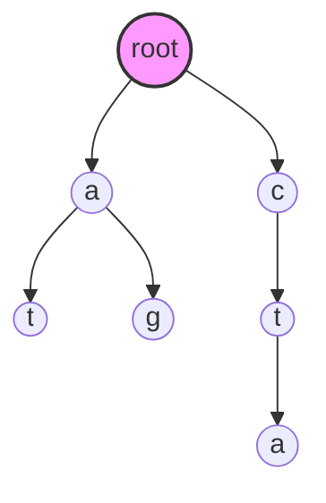
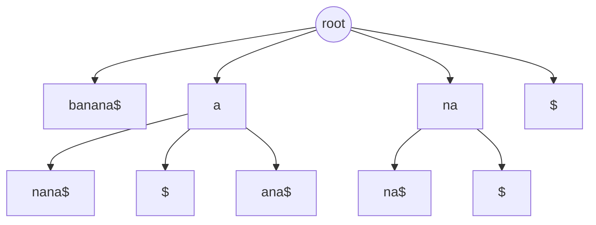
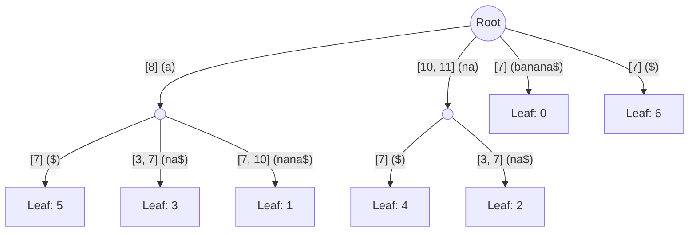

---
{"publish":true,"created":"2025-11-24T10:37:54.000+08:00","modified":"2026-01-05T19:08:54.798+08:00","tags":["BWT","algorithm"],"cssclasses":""}
---

## Read Mapping challenge

在生物信息学中，Read mapping（序列比对）是将测序仪产生的原始reads向基因组比对, 这是解释转录read的前提。

在mapping过程中：
- 输入 (Reads)：数百万甚至数十亿条短序列，每条长度通常在 100-300 bp 之间。
- 参考 (Reference)：如人类基因组，长度约为 30 亿 ($3 \times 10^9$) 个碱基。

如果采用传统的动态规划（如 Smith-Waterman 算法），将每一条 Read 与基因组进行全长比对，其时间复杂度为 $O(nm)$。在如此巨大的数据规模下，这种计算量是完全不可接受的。

Read mapping 的本质问题，可以抽象为字符串匹配问题：

> “如何在巨大的参考文本 $T$ 中，快速找到查询串 $P$ 所有可能的出现位置？”

为了解决这个问题，算法设计的思路发生了从“扫描文本”到“查询索引”的范式转移。

---

## Trie（前缀树）

### 形式化说明

Trie 是一种有序树数据结构。给定一个字符串集合 $S$，Trie 满足以下性质：
- 根节点不包含字符，除根节点外的每个节点都只包含一个字符。
- 从根节点到某一节点，路径上经过的字符连接起来，为集合 $S$ 中某个字符串的前缀。

### 直观理解

Trie 将公共前缀合并，极大地减少了存储空间和查询时间。它非常适合处理“固定模式集合”的匹配（例如在英语词典中查找单词），查询时间仅与查询词的长度有关 $O(|P|)$，而与字典大小无关。

### 例子

假设我们有模式集合 $S = \{\text{at, ag, cta}\}$。

构建的 Trie 结构如下：



### 实现

这是一个最简的 Python 实现，用于理解树的构建：

```Python
class TrieNode:
    def __init__(self):
        self.children = {}
        self.is_end = False

class Trie:
    def __init__(self):
        self.root = TrieNode()

    def insert(self, word):
        node = self.root
        for char in word:
            if char not in node.children:
                node.children[char] = TrieNode()
            node = node.children[char]
        self.is_end = True

    def search(self, word):
        node = self.root
        for char in word:
            if char not in node.children:
                return False
            node = node.children[char]
        return True # 这里简化处理，仅判断前缀是否存在
```


> Trie前缀树 用于查找字符串的所有前缀。
> 但在 Read mapping 中，Read 可能匹配到基因组的任意位置（即基因组的任意子串）。
> 如果希望类似使用该数据结构，我们需要将基因组所有可能的子串 $\frac{n \times (n-1)}{2}$ 都插入树中，这在空间上是不可行的。


## Suffix Tree

### 动机

为了解决“任意子串匹配”问题，我们观察到例如，要找BANANA中的子串 `NAN`，我们只需在后缀 `NANA` 的路径上走几步就能找到。

这说明:
> 文本 $T$ 的任意子串，必然是 $T$ 的某个后缀的前缀。
> 只要我们索引了所有**后缀**，我们就隐式地索引了所有**子串**。


> [!NOTE]
> Suffix Trie 之所以大，是因为有很多非分支的单链路径（例如 `ANA` 可能由 `A`->`N`->`A` 三个节点组成）。Suffix Tree 通过**路径压缩**（Path Compression），将没有分支的路径合并为一条边（Edge），并用坐标（Start, Length）来表示边上的字符，而不是存储字符本身

给定文本 $T$（长度为 $n$），其后缀集合定义为：

$$Suf(T) = \{ T[i:n] \mid 0 \le i < n \}$$

后缀树是 $Suf(T)$ 的压缩 Trie（Compressed Trie）。“压缩”意味着将没有分支的单路径节点合并，使得每条边可以标记一个字符串序列。

既然子串是后缀的前缀，如果我们把所有后缀都插入一个 Trie，那么判断 $P$ 是否在 $T$ 中出现，就等同于判断 $P$ 是否为该 Trie 的某个前缀。这将搜索复杂度严格控制在 $O(|P|)$。


### 例子

以文本 $T = \text{banana\$}$ 为例。

其后缀包括：banana\$, anana\$, nana\$, ana\$, na\$, a\$, \$。

构建的部分后缀树（为了直观，展示逻辑结构）如下：



> [!NOTE]
> 在后缀树中,如果存储的是整个后缀,对于一个长度为 N 的文本，其所有后缀的总长度是 N(N+1)/2，即 O(N2)。
> 实际后缀树中，边存储的是索引范围而非完整字符串, 这样整个空间复杂度为O(N).



### 实现

```Python
def get_suffixes(text):
    """生成所有后缀"""
    # 0-based, 左闭右开
    return [text[i:] for i in range(len(text))]

# 示例
text = "banana$"
suffixes = get_suffixes(text)
# 结果: ['banana$', 'anana$', 'nana$', 'ana$', 'na$', 'a$', '$']
# 后缀树即为这些字符串构成的压缩 Trie
```

> [!INFO] 后缀树应用于人类基因组的内存占用
> 
> 后缀树虽然解决了搜索时间问题，但付出了巨大的空间代价。由于通过大量的指针连接节点，其空间消耗通常是原文本大小的 20 到 50 倍。对于 3GB 的人类基因组，这意味着需要上百 GB 的内存，这在早期的生物计算中是昂贵的。

---

## Suffix Array

为了进一步减少内存占用, 我们考虑下面的情况. 
将字符串所有后缀按照其位置分配序号, 然后将后缀按照字典序进行排序, 将排序后的序号保存. 

例如:
$T = \text{banana\$}$

|i|Index|Suffix|
|---|---|---|
|0|6|$|
|1|5|a$|
|2|3|ana$|
|3|1|anana$|
|4|0|banana$|
|5|4|na$|
|6|2|nana$|

此时 $SA = [6, 5, 3, 1, 0, 4, 2]$。

此时对于任意query我们可以通过二分查找,在这个有序后缀list中进行查找.

$SA$ 是一个整数数组，存储了 $T$ 的所有后缀按字典序排序后的起始索引。

满足：

$$T[SA[i]:] < T[SA[i+1]:]$$

> [!NOTE]
> $SA$ 本质上是后缀树的所有叶子节点，按照从左到右的顺序排列。它去掉了树的内部节点和边，只保留了最核心的排序信息。通过二分查找，我们可以在 $O(|P| \cdot \log n)$ 时间内找到 $P$。

### 代码实现

朴素构造法（非 $O(n)$，仅供理解）：

```Python
def build_sa(text):
    n = len(text)
    # 生成 (suffix, index) 的元组列表
    suffixes = [(text[i:], i) for i in range(n)]
    # 按后缀字典序排序
    suffixes.sort() 
    # 提取排序后的原始索引
    sa = [item[1] for item in suffixes]
    return sa

text = "banana$"
sa = build_sa(text)
print(f"SA: {sa}")
```

### LCP (Longest Common Prefix)

为了加速二分查找，我们通常结合 LCP 数组。


**LCP 数组**（最长公共前缀数组）是一个辅助数组，用于存储后缀数组中**相邻**两个后缀之间的最长公共前缀的长度。
- **定义**：$LCP[i]$ 等于后缀数组中第 $i$ 个后缀 $T[SA[i]:]$ 与前一个后缀 $T[SA[i-1]:]$ 的最长公共前缀的长度,。
- **直观理解**：既然后缀数组 $SA$ 已经按照字典序排好了，那么相邻的后缀通常非常相似。LCP 数组就是量化这种“相似度”的指标。

$$
LCP[i] = \text{length of common prefix between } T[SA[i]:] \text{ and } T[SA[i-1]:]
$$

这相当于后缀树中相邻叶节点的“最低公共祖先”深度。有了 LCP，我们可以跳过大量重复字符的比对。

#### 例子: 计算LCP

假设文本 $T = \text{banana\$}

首先，列出所有后缀并按字典序排序（`$` < `a` < `b` < `n`）：

|排名 ($i$)|起始索引 ($SA[i]$)|后缀内容 ($T[SA[i]:]$)|
|:--|:--|:--|
|0|6|`$`|
|1|5|`a$`|
|2|3|`ana$`|
|3|1|`anana$`|
|4|0|`banana$`|
|5|4|`na$`|
|6|2|`nana$`|

然后, 我们计算每一行后缀与**上一行**后缀的公共前缀长度：

- **$i=1$**: 比较 `a$` 和 `$`。公共前缀为空。$\rightarrow LCP = 0$
- **$i=2$**: 比较 `ana$` 和 `a$`。公共前缀为 `a`。$\rightarrow LCP = 1$
- **$i=3$**: 比较 `anana$` 和 `ana$`。公共前缀为 `ana`。$\rightarrow LCP = 3$
- **$i=4$**: 比较 `banana$` 和 `anana$`。无公共前缀。$\rightarrow LCP = 0$
- **$i=5$**: 比较 `na$` 和 `banana$`。无公共前缀。$\rightarrow LCP = 0$
- **$i=6$**: 比较 `nana$` 和 `na$`。公共前缀为 `na`。$\rightarrow LCP = 2$

如果不使用 LCP，在 $SA$ 上进行二分查找模式串 $P$ 的时间复杂度是 $O(|P| \cdot \log N)$，因为每次二分比较都需要从头匹配模式串 $P$。 有了 LCP，我们可以**跳过已经匹配过的字符**，将复杂度优化到 $O(|P| + \log N)$。

一个关键性质：任意两个后缀 $SA[i]$ 和 $SA[j]$ ($i<j$) 的最长公共前缀长度，等于 LCP 数组在区间 $i+1$ 到 $j$ 之间的**最小值**。
$$
LCP(SA[i], SA[j]) = \min(LCP[k]) \quad \text{for } k=i+1 \dots j 
$$


#### 例子: 使用LCP加速

假设我们要搜索模式串 **$P = \text{ananas}$**。

1. **第一次比较**（二分查找中间位置）：
    - 假设我们比较 $SA$ (`anana$`)。
    - 我们发现 $P$ (`ananas`) 与 $SA$ (`anana$`) 前 5 个字符 `anana` 匹配。
    - 在第 6 个字符，$P$ 是 `s`，而 $SA$ 结束了（或者看作 `$`），`s` > `$`。所以我们要往**右边**找。
    - **关键点**：我们记住这里匹配了 **5** 个字符。
2. **第二次比较**（如果不加速）：
    - 假设下一个二分点是 $SA$ (`banana$`)。
    - 我们重新拿 $P$ (`ananas`) 和 `banana$` 从头比。第一个字符 `a` vs `b`，不匹配。
    - 浪费了时间。
3. **第二次比较**（使用 LCP 加速）：
    - 我们知道上一次在 $SA$ 匹配了 **5** 个字符。
    - 我们要查 $SA$。利用 LCP 数组的性质，我们查看 $LCP[3+1 \dots 4]$ 之间的最小值（即 $LCP$）。
    - **查表发现 $LCP = 0$**。
    - 这意味着 $SA$ (`anana$`) 和 $SA_{2}$ (`banana$`) 连第 1 个字符都不一样。
    - **推论**：既然 $P$ 和 $SA$ 极其相似（前 5 个一样），而 $SA_{2}$ 和 $SA$ 完全不相似，那么 $P$ 肯定也不像 $SA_{2}$。我们甚至不需要比较 $P$ 和 $SA_{2}$ 的内容就能确定二者不同，或者只需要比较第 0 个字符就能确定关系。

> [!NOTE] 更典型的“跳过”场景
> 假设我们已知 $P$ 与当前的左边界 $SA[L]$ 匹配了 $l$ 个字符，与右边界 $SA[R]$ 匹配了 $r$ 个字符。现在要检查中间值 $SA[M]$。 我们查看 $LCP$ 数组在区间 $[L, M]$ 之间的最小值，记为 $k$。
> - **如果 $k > l$**：说明 $SA[M]$ 与 $SA[L]$ 的公共前缀比 $l$ 还长。因为 $P$ 已经和 $SA[L]$ 匹配了 $l$ 个字符，所以 $P$ 和 $SA[M]$ 的前 $l$ 个字符**必然相同**。我们不需要从头比较，直接从第 $l+1$ 个字符开始比即可。


> [!TIP] LCP和后缀树的关系
> - 后缀树通过**压缩边**来节省空间，公共的路径（边）代表了公共前缀。
> - $SA[i]$ 和 $SA[i-1]$ 在后缀树中对应的叶子节点，它们在树中的**最低公共祖先（LCA）**所代表的字符串长度，正是 $LCP[i]$ 的值。

## Burrows-Wheeler Transform

后缀数组将内存降低到了文本的 4-8 倍（取决于整数位宽），但对于海量数据仍有改进空间。

BWT 的出现是一个转折点，它最初用于数据压缩，后来发现天然支持高效搜索。

### BWT 的构造

令 $M$ 为文本 $T$ 的所有循环移位（Rotations）组成的矩阵。将 $M$ 的行按字典序排序。

BWT 字符串 定义为排序后矩阵的最后一列 (L列)。

排序是基于即矩阵的第一列进行的。因此，矩阵的每一行 $i$，其最后一列字符 $L[i]$ 正是第一列字符 $F[i]$ 在原文本中的前一个字符。

由于具有相似前缀的后缀排列在一起，它们的前一个字符往往也是相同的。这导致 BWT 串中出现大量的连续重复字符。

> [!NOTE]
> 这里是一个对于BWT能够让L列聚集相同字符的解释, 更详细解释见 [[reads mapping#为什么BWT能够聚集重复字符?]]

#### 例子: 对banana做BWT

$T = \text{banana\$}$

1. 列出轮转 $\to$ 2. 排序 $\to$ 3. 取最后一列

| Sorted Rotations (M) | r                |
| ------------------------ | ---------------- |
| $ banana             | $\to$ L[0]=a |
| a $banan             | $\to$ L[1]=n |
| a na$ban             | $\to$ L[2]=n |
| a nana$b             | $\to$ L[3]=b |
| b anana$             | $\to$ L[4]=$ |
| n a$bana             | $\to$ L[5]=a |
| n ana$ba             | $\to$ L[6]=a |

得到 $BWT = \text{annb\$aa}$。

### BWT 和压缩算法的关系?

观察上面的例子，原始序列 `banana$` 没有明显连续字符，但 BWT 后的 `annb$aa` 出现了 `nn` 和 `aa` 的聚集。这种聚集使得 Run-Length Encoding (RLE) 等算法非常高效。

#### 什么时候起不到压缩效果?

并非所有文本都能被 BWT 有效“聚类”。

$T = \text{abcdefg\$}$

排序后的轮转矩阵几乎是随机错开的，BWT 结果为 g$abcdef。没有任何连续字符，压缩收益为零。这说明 BWT 依赖于文本本身的重复结构。

#### 为什么 DNA 适合 BWT？

DNA 序列是 BWT 的绝佳应用场景：

1. 字母表小：只有 A, C, G, T 四种字符。大大增加了重复的概率. 
2. 重复结构丰富：
    - 生物学重复：微卫星 (Microsatellites)、串联重复 (Tandem repeats)。
    - K-mer 重复：在基因组中，相同的短序列（如 `GATCA`）会出现在很多位置，导致它们在排序后聚集，进而使它们的前驱字符也大概率聚集。

### 为什么BWT能够聚集重复字符?

为什么具有重复结构的字符串能够经过BWT重复字符能够在L聚集?

一个听起来很有道理的解释是: 如果字符串中有很多连续出现的重复结构, 例如abc. 那么F列经过排序之后, 由于这些重复结构会被聚集, 而因为这些结构是连续出现的, 所以abc之前还是abc, 因此在L列中, a就被聚集了.

但是这个解释是片面的, 只解释了连续重复结构这种情况. 见下面的例子 $abacad$$

| Sorted Rotations | F   | L   |
| ---------------- | --- | --- |
| $abacad          |     | d   |
| abacad$          |     | $   |
| acad$ab          |     | b   |
| ad$abac          |     | c   |
| bacad$a          |     | a   |
| cad$aba          |     | a   |
| d$abaca          |     | a   |
可以看到, 这个字符串中没有任何重复结构, 但是a仍然在L列中聚集.

为了理解为什么BWT能够聚集重复字符,  见这个例子 $abcabdabf$$

| Sorted Rotations | F   | L   |                |                                                  |
| ---------------- | --- | --- | -------------- | ------------------------------------------------ |
| $abcabdabf       |     | f   |                |                                                  |
| abdabf$abc       |     | c   | abcabdabf$ |                                                  |
| abf$abcabd       |     | d   | abcabdabf$ | 这里重复字符串ab前字母并不相同, <br>因此虽然这些行在L中靠近,但是他们L列并不是重复字符 |
| bcabdabf$a       |     | a   | abcabdabf$ |                                                  |
| bdabf$abca       |     | a   | abcabdabf$ |                                                  |
| bf$abcabda       |     | a   | abcabdabf$ | 由于重复字符串 ab中b的重复出现, 使得他们F排序后聚在一起, 从而a在L中聚集        |
| cabdabf$ab       |     | b   |                |                                                  |
| dabf$abcab       |     | b   |                |                                                  |
| f$abcabdab       |     | b   |                |                                                  |
所以即便不是连续重复, 只要是重复(且重复模式长度 $\text{length of pattern} \geq 2$)就可以很大程度上让BWT发挥在L聚集重复字符的效果. 你可以尝试一下

> [!NOTE]
> 现在请重新思考 $banana$$ 为什么所有a
> 对于开头的例子为什么$abacad$$ 经过BWT后a会聚集?  巧合还是必然, 能构造出反例吗?

> [!NOTE]- 只是一个巧合吗?
> 确实是一个巧合, 对于这个字符串 $eiaedbcebde$$
> 这个字符串多次出现了e, 但 BWT并不能将字符聚集. 
> 本质上是由于该重复模式长度只有1.


## BWT 的逆变换

BWT 的神奇之处在于它是可逆的，且不需要存储完整的轮转矩阵。

定义 LF (Last-to-First) 映射：

$$
\begin{align*}
c &= L(i) \\
LF(i) &= C[c] + Occ(c, i)
\end{align*}
$$

- $LF(i)$: L第i个字符对应F列的顺序
- $L[i]$：BWT 列第 $i$ 个字符。
- $C[c]$：字符 $c$ 在排序后文本（F列）中第一次出现的索引（即小于 $c$ 的字符总数）。
- $Occ(c, i)$：字符 $c$ 在 $BWT[0:i]$（即前 $i$ 个字符，不含 $i$）中出现的次数。

LF 映射揭示了 BWT (L列) 和 F列 之间的一一对应关系：L 列中第 $k$ 次出现的字符 'a'，对应于 F 列中第 $k$ 次出现的字符 'a'。

利用LF mapping，加上F列的前一个字符是对应的L列的字符, 我们可以从 BWT 倒推还原出原始序列。

### 为什么字符出现L列和F列他们的顺序是相同的?

以 $banana$$为例, 为了区分a的相对顺序,使用数字编号进行区分. $ba_{1}na_{3}na_{3}$对于sorted rotation以任意字符开头的一组, 例如这里的a

| Sorted Rotations(M) | L   |
| ------------------- | --- |
| $banan==a==         | a3  |
| a3$banan            | n   |
| a2na$ban            | n   |
| a1nana$b            | b   |
| banana$             | $   |
| na$ban==a==         | a2  |
| nana$b==a==         | a1  |

去掉这一组的第一个字符, 这一组仍然是按照字母序排列的, 把a挪到这一组右边, 得到了对应的其他行(加亮表示).

| Sorted Rotations(M) | L   |
| ------------------- | --- |
| $banan==a==         | a3  |
| a$banan             | n   |
| ana$ban             | n   |
| anana$b             | b   |
| banana$             | $   |
| na$ban==a==         | a2  |
| nana$b==a==         | a1  |

他们仍然是按照字母序排列的, 所以a的相对顺序不会变.

### 例子：还原 banana

我们已知 $BWT = \text{annb\$aa}$。 $F = \text{\$aaabnn}$。
$C$ 表：$\$:0, a:1, b:4, n:5$。

还原步骤（从 $\$$ 前面一个字符开始）：

1. 当前指向 BWT[0] = 'a'。这是第 1 个 'a'。
    - 在 F 列中，第 1 个 'a' 位于索引 1。
    - 当前还原：`a`
2. 跳转到索引 1。BWT[1] = 'n'。这是第 1 个 'n'。
    - 在 F 列中，第 1 个 'n' 位于索引 5。
    - 当前还原：`na`
3. 跳转到索引 5。BWT[5] = 'a'。这是第 2 个 'a'。
    - 在 F 列中，第 2 个 'a' 位于索引 2。
    - 当前还原：ana
        ...以此类推，直到遇到 $。
### 实现

```Python
def inverse_bwt(bwt):
    # 1. 构建 C 表 (统计小于 char 的字符总数)
    sorted_bwt = sorted(bwt)
    c_table = {}
    for i, char in enumerate(sorted_bwt):
        if char not in c_table:
            c_table[char] = i
    
    # 2. 构建 LF mapping
    # 为了简化，我们预计算每一行的 LF 值
    # lf[i] 存储的是：如果当前在行 i，下一步跳到哪一行
    lf = [0]  len(bwt)
    occurrences = {} 
    
    for i, char in enumerate(bwt):
        if char not in occurrences:
            occurrences[char] = 0
        # LF(i) = C[char] + 当前字符是第几次出现
        lf[i] = c_table[char] + occurrences[char]
        occurrences[char] += 1
        
    # 3. 倒序还原
    # 假设已知结束符 '$' 在 bwt 中的位置作为起点不太直观
    # 通常逆变换是从 BWT 对应的原始 SA[i]=0 的行开始，
    # 但为了简单，我们寻找 '$' 所在的位置，它对应原文本的最后一位
    curr_idx = bwt.index('$') 
    result = ""
    
    # 长度为 n，执行 n 次
    for _ in range(len(bwt)):
        result = bwt[curr_idx] + result
        curr_idx = lf[curr_idx]
        
    # 结果包含 $，去除即可得到 banana
    return result

print(f"Restored: {inverse_bwt('annb$aa')}")
```


## Backward Search

在利用BWT的L列进行search, 我们的目标是找到 $P$ 在 $SA$ 中的区间 $[L, R)$。这意味着所有以 $P$ 为前缀的后缀，其在 $SA$ 中的索引都在这个区间内。

> [!NOTE] 能够进行search的理论前提
> - Rotation的F按照字典序排列, 如果存在匹配pattern的字串, 那么所有匹配的子串一定在一个连续区间内.
> - 使用递推公式后, 相应区间长度不断减小, 直至减小为1/0

当我们往回读一个字符 $c$ 时，实际上是在询问：“在当前的后缀集合前面加上字符 $c$，会变成哪些新的后缀？”而 L[i] 恰好指明了那些后缀的上一个字符是什么, 因此可以据此在区间[L, R], 来进行增加字符c后的搜索.

递推公式（处理字符 $c$）：
$C[c]$ :在 F 中所有字符中，小于 c 的字符数,推论 $F[C[c]]$ 是 F 中第一个字符 c.
$Occ(c,i)$: 在 L[0..i−1] 区间中字符 c 出现的次数.

$$
\begin{align*}
NewL = C[c] + Occ(c, L)\\
NewR = C[c] + Occ(c, R)
\end{align*}
$$
### BWT递推公式

LF-mapping 就是在“后缀图”中跳到以前一个字符开头的后缀。

| SA index i | 后缀起点 SA[i] | 后缀<br>(省略$后内容) | BWT<br>后缀在文本中的前一个字符 | 后缀第一个字符<br>F[i] | 后缀前一个字符<br>L[i] |
| ---------- | ---------- | -------------- | ------------------- | --------------- | --------------- |
| 0          | 6          | $banana        | T[5] = 'a'          | $               | a               |
| 1          | 5          | a$             | T[4] = 'n'          | a               | n               |
| 2          | 3          | ana$           | T[2] = 'n'          | a               | n               |
| 3          | 1          | anana$         | T[0] = 'b'          | a               | b               |
| 4          | 0          | banana$        | 前一字符是 $（文本末尾）       | b               | $               |
| 5          | 4          | na$            | T[3] = 'a'          | n               | a               |
| 6          | 2          | nana$          | T[1] = 'a'          | n               | a               |

> [!NOTE] 为什么区间会不断缩小
> backward search的递推公式和LF mapping的式子的区别在于, Occ(c(i), j)中恢复字符串需要i=j, 而backward search则不是.
> 这两个递推式都是在从L的i, 推导F的区间
> 
>  $Occ(c, L/R)$ 实际上都是在区间 $L, R$ 内进行逐个元素判断 哪些suffix满足上一位为c, 即$L(i) = c$, 是一个取子集的操作.

### 例子: 在banana搜索ana

| Sorted Rotations(M) | F   | L   |
| ------------------- | --- | --- |
| $banana             | $   | a   |
| a$banan             | a   | n   |
| ana$ban             | a   | n   |
| anana$b             | a   | b   |
| banana$             | b   | $   |
| na$bana             | n   | a   |
| nana$ba             | n   | a   |

在 banana$ 中搜索 "ana"
1. 初始状态：匹配空串，范围是整个 $SA$。
    - 区间 $[0, 7)$ (左闭右开)
2. 处理 'a' (倒数第一个字符)：
    - 查看 BWT 在区间 $[0, 7)$ 中 'a' 的出现情况
    - $C['a'] = 1$
    - $Occ('a', 0) = 0$ (区间开始前有 0 个 a)
    - $Occ('a', 7) = 3$ (区间结束前有 3 个 a)
    - 新区间 $L = 1+0=1$, $R = 1+3=4$。即 $[1, 4)$
    - 对应 F 列的范围，正是所有以 'a' 开头的后缀
3. 处理 'n' (倒数第二个字符)：
    - 查看 BWT 在区间 $[1, 4)$ 中 'n' 的出现情况。
    - $C['n'] = 5$。
    - $Occ('n', 1) = 0$ (BWT[0]是a，无n)
    - $Occ('n', 4) = 2$ (BWT[0..3]是annb，有2个n)
    - 新区间 $L = 5+0=5$, $R = 5+2=7$。即 $[5, 7)$。
4. 处理 'a' (倒数第三个字符)：
    - 查看 BWT 在区间 $[5, 7)$ 中 'a' 的出现情况。
    - $C['a'] = 1$。
    - $Occ('a', 5) = 1$ (BWT[0..4]中有1个a)
    - $Occ('a', 7) = 3$ (BWT[0..6]中有3个a)
    - 新区间 $L = 1+1=2$, $R = 1+3=4$。即 $[2, 4)$。

最终结果：区间 $[2, 4)$。对应 $SA$ 中的索引 3 和 1，即 `ana$` 和 `anana$`，匹配成功。

### 代码实现 

```Python
def count_occurrences(pattern, bwt, c_table):
    """
    计算 pattern 在 text 中出现的次数
    """
    # 0-based 左闭右开区间，初始为整个范围
    l, r = 0, len(bwt)
    
    # 倒序遍历 pattern
    for char in reversed(pattern):
        if char not in c_table:
            return 0 # 字符不存在
            
        # 简单实现 Occ：直接切片统计 (实际 FM-index 会用 Rank 数据结构优化这里)
        # Occ(c, k) = bwt[:k].count(c)
        occ_l = bwt[:l].count(char)
        occ_r = bwt[:r].count(char)
        
        l = c_table[char] + occ_l
        r = c_table[char] + occ_r
        
        if l >= r:
            return 0 # 区间为空，匹配失败
            
    return r - l

# 测试数据
bwt_str = "annb$aa"
# C table: $:0, a:1, b:4, n:5
c_tab = {'$': 0, 'a': 1, 'b': 4, 'n': 5}

count = count_occurrences("ana", bwt_str, c_tab)
print(f"Count of 'ana': {count}") # 应输出 2
```

---

## FM-index

你可能会问：上面的代码中 `bwt[:r].count(char)` 不是每次都要扫描整个字符串吗？这样效率岂不是很低？

为了避免遍历，FM-index 会预先计算一些 Checkpoints（例如每隔 128 个字符记录一次各个字符的计数）。
- Rank(c, i)：$O(1)$ 时间内返回前 $i$ 个位置中 $c$ 的数量。
- 通过结合 Checkpoint 和小范围的位操作（Wavelet Tree 或 RRR 编码），FM-index 既压缩了文本，又保持了极快的 $O(1)$ 查询能力。

## 小结

回顾我们的推导路径：
1. 后缀结构：为了解决 Read Mapping 规模问题，我们将“全基因组扫描”转化为“所有可能后缀的索引查询”。
2. BWT：通过轮转排序，利用 DNA 的重复模式，将复杂的后缀树结构转化为了单纯的字符串，并实现了数据压缩。
3. FM-index：利用 LF-mapping 的数学性质，在压缩后的数据上实现了高效的 Backward Search。


BWA、Bowtie 等现代比对软件能够在一台普通的笔记本电脑上，处理数以亿计的基因组数据。

> [!NOTE]
> 虽然 FM-index 解决了精确匹配，但在实际测序中，Reads 往往包含测序错误或变异（SNP/Indel）。因此，现代比对算法通常采用 Seed-and-Extend 策略：先用 FM-index 快速定位完全匹配的短种子（Seeds），然后在这些种子周围进行局部的动态规划比对。

 
## 参考

[[Areas/Move-to-front transform]]
[[Resources/游程编码]]
[[Areas/序列比对]]