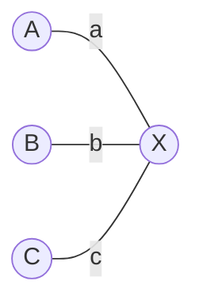
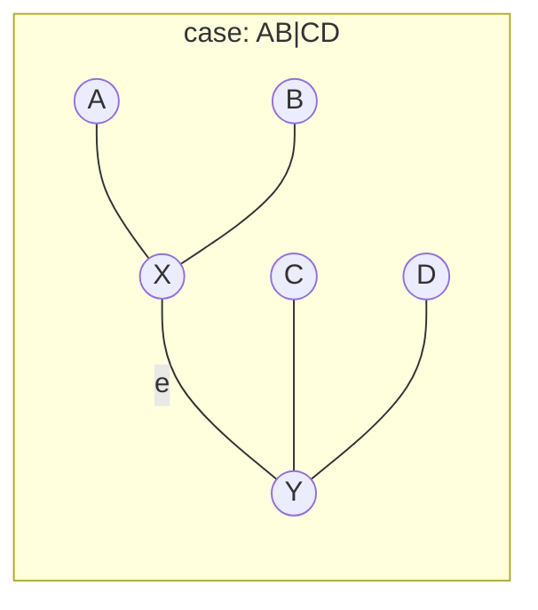

---
{"publish":true,"created":"2025-11-26T10:52:41.000+08:00","modified":"2025-12-07T21:09:35.065+08:00","cssclasses":""}
---


## motivation：距离矩阵背后的几何

在生物信息学或网络拓扑推断中，我们经常面对一个基础问题：给定 $N$ 个对象的两两距离矩阵 $D = (d_{ij})$，我们能否重构出一棵树，使得树上两点间的路径长度恰好等于观察到的距离？

这是一个反直觉的问题。通常我们认为“树”是一个组合结构（拓扑），而“距离”是一个线性代数对象（数值）。但在所有距离还原问题中，“树结构”表现出一种特殊的几何刚性。

并非所有的距离矩阵都能还原为树。能还原的矩阵，我们称之为**加性矩阵 (Additive Matrix)** 或**树度量 (Tree Metric)**。

## 最小例子：为什么是 4 个点？

为了判断一个矩阵是否“合法”，并从中提取拓扑，我们需要深入到树的最小子结构中。

### 三点结构不包含树的全局结构信息

给定三个点 A, B, C，无论它们之间的距离如何（只要满足三角不等式），我们永远只能画出一个“星型”结构（Star Tree）。它们汇聚到一个中心节点 X。



在这个结构中，我们有 3 个已知量 ($d_{AB}, d_{BC}, d_{AC}$) 和 3 个未知量（边长 $a, b, c$）。方程组有唯一解，不存在任何冗余信息来区分不同的分支结构。

> [!NOTE]
> 在平面几何中，三点确定一个平面。在树的几何中，三点却无法确定拓扑。

### 四点是包含树全局信息的最小子结构

当引入第 4 个点 D 时，情况发生了质变。对于 4 个叶节点，存在三种本质上不同的无根二叉树拓扑：
1. **$AB|CD$**：A 和 B 在一边，C 和 D 在另一边。
2. **$AC|BD$**：A 和 C 聚类。
3. **$AD|BC$**：A 和 D 聚类。



这种结构导致距离之间产生了**强约束**。考虑上图，我们可以计算三组对边距离之和：

$$\begin{aligned} S_1 &= d(A,B) + d(C,D) \\ S_2 &= d(A,C) + d(B,D) \\ S_3 &= d(A,D) + d(B,C) \end{aligned}$$

如果中间边（internal edge）的长度 $e > 0$，你会发现一个极其严格的大小关系：

$$S_1 < S_2 = S_3$$

也就是说，**三个求和项中，必须有两个较大的数相等，且它们严格大于第三个数。** 那个较小的和 ($S_1$) 对应的配对 ($A,B$) 和 ($C,D$)，就是树上的真实邻居。

## 从线性方程组看树重建

从代数角度看，重建树的本质是解线性方程组。
- **已知量**：距离矩阵中的 $\binom{n}{2}$ 个数值。
- **未知量**：树上的边长。对于 $n$ 个叶子的二叉树，边数为 $2n-3$。
    
> [!NOTE] 信息的冗余
> 
> 当 $n$ 增大时，方程数量 $\binom{n}{2} \approx O(n^2)$ 远大于未知数数量 $O(n)$。
> 
> 这种巨大的**超定 (Over-determined)** 状态意味着：一个随机生成的距离矩阵几乎不可能是树度量。只有满足特定几何约束的矩阵，才有解。

## 四点定理：局部 $\leftrightarrow$ 全局

**四点定理 (Four Point Condition)** 说明了这样一种等价关系: 对于一组对象, 任意四点满足最大两者相等,和 能够重建树结构 是等价的.

### 定理表述

一个距离矩阵 $D$ 对应一棵加性树，当且仅当对于任意四个元素 $i, j, k, l$，在以下三个和中：

$$d_{ij} + d_{kl}, \quad d_{ik} + d_{jl}, \quad d_{il} + d_{jk}$$

最大的两个数值相等。

### 直观理解
- **必要性**：如果是一棵树，这一定成立（如 2.2 节所示）。
- **充分性**：Buneman 在 1974 年证明，只要所有四元组都满足这个条件，我们就可以唯一重建出一棵树。
    

这意味着，我们不需要通过全局优化来构树，只需要盯着所有的“四元组”看，就能通过局部的 split（划分）拼凑出全局的拓扑。

## 暴力利用四点定理构树

既然四点定理是充要条件，理论上我们可以设计一个基于“纯原理”的暴力算法。

### 算法思路

1. **枚举**：遍历所有可能的四元组 $(i, j, k, l)$，共 $\binom{n}{4}$ 个。
2. **检查**：对每个四元组，检查是否满足四点条件。
3. **推断**：如果满足，找出那个“最小的和”对应的配对（例如 $d_{ij} + d_{kl}$ 最小，则推断存在 split $ij|kl$）。
4. **汇总**：收集所有支持的 splits，构建一致性拓扑（Buneman Graph）。
    
### 复杂度分析

这个方法极其昂贵, 时间复杂度$O(n^4)$
### 实现

```python
import numpy as np
import itertools
import time

def check_four_point_condition(D, tol=1e-9):
    n = D.shape[0]
    quartets = []
    
    # 遍历所有唯一的 4 个点的组合
    for i, j, k, l in itertools.combinations(range(n), 4):
        # 计算三个 sum
        s1 = D[i, j] + D[k, l] # (ij | kl)
        s2 = D[i, k] + D[j, l] # (ik | jl)
        s3 = D[i, l] + D[j, k] # (il | jk)
        
        sums = sorted([(s1, {i, j}, {k, l}), 
                       (s2, {i, k}, {j, l}), 
                       (s3, {i, l}, {j, k})], key=lambda x: x[0])
        
        small, mid, large = sums[0][0], sums[1][0], sums[2][0]
        
        # 检查: 最大两个必须相等 (mid == large)
        if abs(mid - large) > tol:
            return False, 0
        
        # 如果 small < mid，说明这是一个有信息的 quartet (中间边长度 > 0)
        # 我们记录下这个拓扑结构
        if small < mid - tol:
            quartets.append(sums[0][1:]) # 记录 ((i,j), (k,l))
            
    return True, len(quartets)

def generate_additive_matrix(n):
    """生成一个模拟的加性距离矩阵（基于随机树）"""
    # 简单模拟：生成随机拓扑过于复杂，这里用简化的距离生成
    # 实际上是用 scipy 或 skbio 会更好，这里为了零依赖手写一个极简版
    # 实际上：对于 n 个点，我们随机生成边长并计算路径距离
    # (此处代码仅为占位逻辑，用于跑通流程)
    tree_dist = np.zeros((n, n))
    # ... 省略复杂的随机树生成代码，直接构造一个满足条件的简单矩阵 ...
    # 为了演示 benchmark，我们用随机矩阵代替，虽然它大概率不是加性矩阵
    # 但足以测试 O(n^4) 的循环耗时。
    return np.random.rand(n, n)

if __name__ == "__main__":
    N_list = [10, 20, 50, 100]
    
    print(f"{'N':<10} | {'Method':<15} | {'Time (s)':<10}")
    print("-" * 40)
    
    for n in N_list:
        # 生成虚数据 (用于测试循环速度)
        D = np.random.rand(n, n)
        D = (D + D.T) / 2
        np.fill_diagonal(D, 0)
        
        start = time.time()
        check_four_point_condition(D) 
        end = time.time()
        
        print(f"{n:<10} | {'BruteForce FPC':<15} | {end - start:.4f}")
```

## Neighbor-Joining (NJ)

暴力法的 $O(n^4)$ 在 $N=100$ 时就已经让人无法忍受。Saitou 和 Nei 在 1987 年提出的 Neighbor-Joining (NJ) 算法，通过一种贪心的策略解决了这个问题。

NJ 的核心并不是直接枚举四元组，而是通过一个修正矩阵 $Q$ 来寻找“最近的邻居”：

$$Q_{ij} = (n-2)d(i,j) - \sum_k d(i,k) - \sum_k d(j,k)$$

### 为什么不直接找最小距离？

直接找最小距离是不对的，因为这忽略了进化速率（即边长）的差异。一个物种如果进化极快（长枝），它和谁的 $d_{ij}$ 都会很大。

$Q$ 矩阵的后两项 $\sum d$ 实际上是在减去全局平均深度。它让我们可以正确地把两个“虽然距离远，但相对其他节点都更近”的节点（Cherries）找出来。

NJ 的复杂度被优化到了 $O(n^3)$（原始）甚至 $O(n^2)$（快速实现），这使它成为了处理成千上万个序列的标准工具。

> [!TIP] 工程启示
> 
> 当 $N$ 翻倍时，四点枚举法的耗时会增加 $2^4 = 16$ 倍。
> 
> 这就是为什么在生物信息学软件（如 Mega, RAxML）中，只有多项式复杂度较低的算法（如 NJ 或 UPGMA）才能作为构建初始树的手段。

## 总结

四点定理（Four Point Condition）给了我们一把尺子，用于判断时候情况下距离矩阵中存在一个完美的树结构。
- **理论上**：它是判定加性矩阵的充要条件，也是 Buneman 构树法的基石。
- **实践上**：直接使用它进行计算过于昂贵 ($O(n^4)$)。Neighbor-Joining 算法通过巧妙的线性近似，保留了构树的准确性，同时规避了高昂的组合爆炸。

