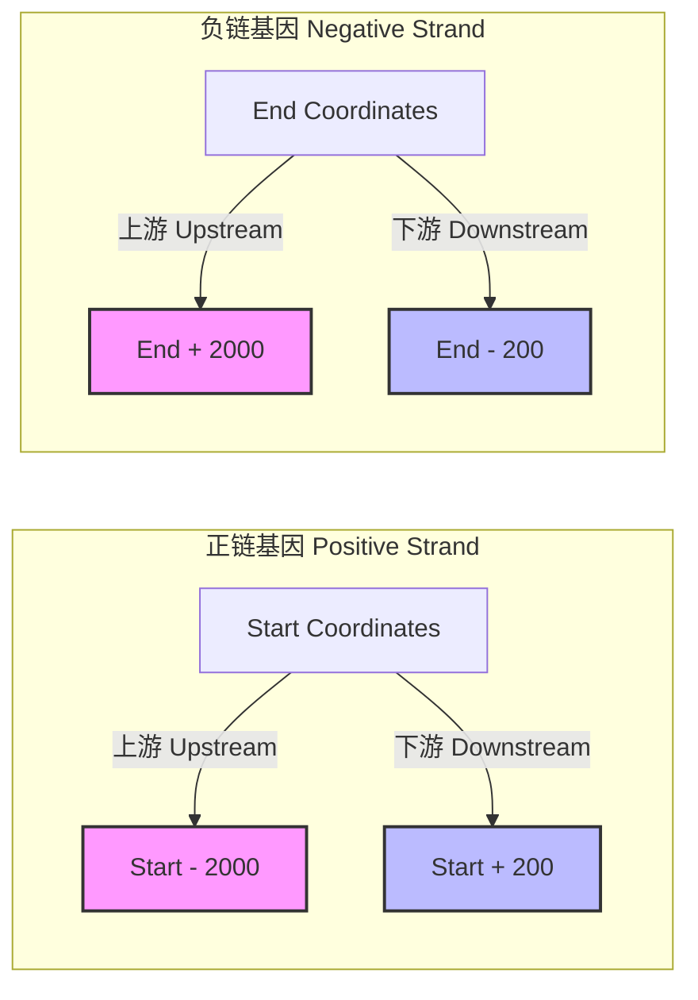
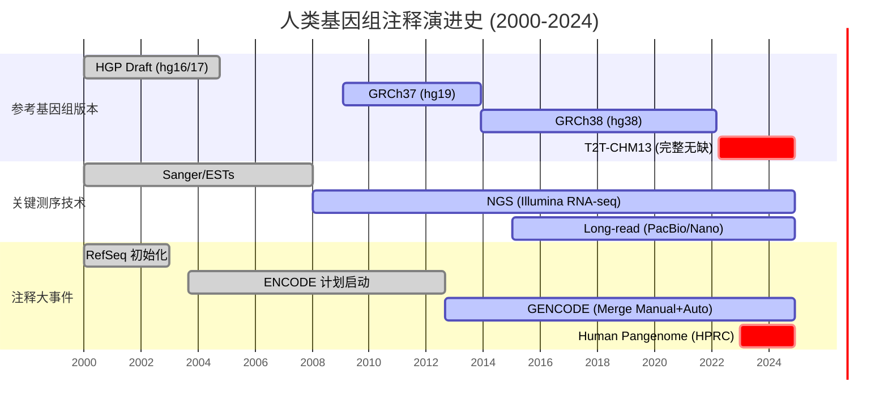

---
{"publish":true,"created":"2025-12-23T21:22:24.906+08:00","modified":"2025-12-25T12:18:32.176+08:00","cssclasses":""}
---


## 基因组注释：构建从序列到功能的映射坐标系

基因组学的核心矛盾，在于海量的 $A, T, C, G$ 原始序列与人类可理解的生物学功能之间的巨大鸿沟。基因组注释（Genome Annotation）并非简单的标签粘贴，而是一个将一维的线性序列转化为多维生物学意义的过程。genome注释精确度直接决定了后续转录组定量、变异检测以及进化分析的信噪比。

注释工作在逻辑上分为两个层次。首先是结构注释，旨在物理上界定基因元件的坐标，即确定外显子（Exon）、内含子（Intron）、非翻译区（UTR）以及启动子的起始与终止位置。

其次是功能注释，旨在赋予这些坐标以生物化学意义，例如该片段编码何种蛋白，参与何种 KEGG 通路或 GO 生物学过程。

![[attachments/Pasted image 20251224213307.png]]


## 选择 RefSeq 还是 Ensembl?

NCBI 维护的 RefSeq 数据库采用了“人工审阅 + 预测”的混合模式，其核心哲学是“去冗余”。RefSeq 旨在提供一个具有代表性的标准序列，每一个条目（如以 $NM\_$ 开头的 mRNA 序列）都代表了一个理想化的生物学模型。这种策略极大地降低了序列比对时的歧义性。相比之下，Ensembl（以及与之对应的 GENCODE）则追求“全覆盖”。通过整合 Havana 小组的人工注释与自动化流程，Ensembl 收录了大量的异构体（Isoforms）、假基因以及非编码 RNA。值得注意的是，GENCODE 是 ENCODE 计划的官方注释版本，二者在基因组坐标上是严格对应的。

>[!TIP] 选择建议
> 在进行基因表达定量（Quantification）或差异表达分析时，首选 RefSeq。其简化的转录本模型能显著减少 Read Mapping 时的多重比对问题，提高定量的稳健性。而在进行变异位点注释（Variant Calling）或探索新转录本时，必须使用 Ensembl/GENCODE。其详尽的异构体信息能确保位于非典型外显子区域的变异不被遗漏，从而提供更完整的基因组坐标覆盖。

> [!WARNING] 版本控制
> 分析中不仅要记录数据库名称，更需严格记录版本号。Ensembl 的更新频率极高（例如 v110），而 RefSeq 则是实时更新。不同版本间坐标的细微漂移（Shift）可能导致后续分析出现系统性偏差。例如，GENCODE v44 与 v43 在 lncRNA 的注释上可能存在显著差异。

> [!NOTE]
> 关于文件格式，GTF 与 GFF3 虽然都用于存储注释信息，但设计逻辑略有不同。GTF 格式采用键值对空格分隔（key "value"），结构扁平，通常只包含 Gene 和 Transcript ID 等核心信息，是大多数比对软件（如 STAR, HTSeq）的首选输入格式。GFF3 则使用等号分隔（key=value），支持更深层级的父子关系描述，适合存储复杂的层级注释信息。

---

## 实战演练：用 Bedtools 提取启动子

在基因组学中，提取启动子（Promoter）是极其常见的需求，通常定义为转录起始位点（TSS）的上游 2000bp 至下游 200bp。

>[!TIP] 核心逻辑：坐标系与生物学方向的映射
>基因组坐标（Genomic Coordinate）是一个绝对的数学索引（单调递增），而 DNA 链的方向性是相对的。理解这一映射是进行任何区间运算的前提。
>
>| 特征维度 | 正链 (Plus Strand, +) | 负链 (Minus Strand, -) |
>| :--- | :--- | :--- |
>| 序列来源 | 与参考基因组 FASTA 文件完全一致 | 参考序列的反向互补 (Reverse Complement) |
>| 5' 端位置 | 坐标区间的最小值 (Start) | 坐标区间的最大值 (End) |
>| 3' 端位置 | 坐标区间的最大值 (End) | 坐标区间的最小值 (Start) |
>| 合成方向 | $5' \to 3'$ 意味着坐标 增大 | $5' \to 3'$ 意味着坐标 减小 |
>
>在计算负链基因的“上游”（Upstream/Promoter）时，必须向坐标增大的方向寻找；而在提取序列时，必须对提取出的 FASTA 序列做反向互补处理，才能得到正确的 mRNA 序列。

Bedtools 的 `-s` 参数是解决这一矛盾的关键。它将物理上的“左/右（Left/Right）”操作符抽象为生物学上的“上游/下游（Upstream/Downstream）”。

我们可以通过以下逻辑图来理解这种坐标变换：



为了获得最精确的启动子区域，我们采用 "定位锚点 -> 双向延伸" 的策略。这种方法比单纯使用 `flank` 更灵活，因为它允许我们在 TSS 的两侧定义不对称的窗口（如 -2000/+200）。

```Bash
# =======================================================
# 阶段一：构建边界围栏
# =======================================================
# 目的：防止延伸操作导致坐标溢出（<0 或 >染色体长度）
# 逻辑：Bedtools 读取此文件，自动将越界坐标截断为 0 或 Max
samtools faidx genome.fa
cut -f 1,2 genome.fa.fai > chrom.sizes

# =======================================================
# 阶段二：数据清洗与标准化
# =======================================================
# 目的：排除外显子等子结构，仅保留转录本层级
# 技巧：排序（sort）虽然不是强制的，但能显著提高 bedtools 处理大数据集时的内存效率
awk '$3 == "transcript"' gencode.v44.annotation.gff3 | \
    sort -k1,1 -k4,4n > transcripts.gff3

# =======================================================
# 阶段三：核心运算 - 定义启动子
# =======================================================

# 步骤 3.1: 定位生物学零点 (TSS)
# 命令解析：
# -bg : 输出 BedGraph 格式
# -5  : 仅报告 5' 端（核心参数！）
#       对于正链，它提取 Start 坐标；
#       对于负链，它自动提取 End 坐标。
bedtools genomecov -bg -5 -i transcripts.gff3 -g chrom.sizes > tss_1bp.bed

# 步骤 3.2: 基于零点进行不对称延伸
# 命令解析：
# -l 2000 : 向"左"延伸 2000bp
# -r 200  : 向"右"延伸 200bp
# -s      : 激活链特异性逻辑（这一步赋予了 l 和 r 生物学意义）
#           正链：Left = Upstream, Right = Downstream
#           负链：Left = Downstream (物理右), Right = Upstream (物理左)
#           注意：这里 bedtools slop 的 -s 逻辑是将 -l 和 -r 严格对应到 5'->3' 方向
#           因此，为了实现 "上游2k, 下游200"，我们需要正确映射参数。

# [!Attention] 参数陷阱
# bedtools slop 的 -s 模式下：
# -l (Left) 总是代表 5' 端方向的延伸距离 (即 Upstream)
# -r (Right) 总是代表 3' 端方向的延伸距离 (即 Downstream)
# 这与物理坐标无关，纯粹是生物学方向。
bedtools slop -i tss_1bp.bed -g chrom.sizes -l 2000 -r 200 -s > promoters_final.bed
```

>[!TIP] 验证建议
>在生成 promoters_final.bed 后，务必抽取几行正链和负链的数据进行人工核对。
>检查正链基因的 End 是否等于原 TSS + 200；
>检查负链基因的 Start 是否等于原 TSS - 200。

> [!NOTE] GFF3 vs GTF
> 在上述流程中，虽然 bedtools 能兼容两种格式，但在后续关联基因 ID 时需注意：GFF3 的 ID 通常看起来像 ID=TRANSCRIPT_001，而 GTF 的 ID 直接存储在 transcript_id "ENST..." 字段中。在进行 awk 文本处理提取 ID 时，GFF3 的分隔符处理通常比 GTF 更为繁琐，这是为何在仅进行简单坐标计算时，GTF 往往更受欢迎的原因。

## 注释预测和金标准

基因结构注释的生成过程，本质上是一个基于证据的统计推断过程。最基础的策略是基于统计模型的从头预测（Ab initio），利用马尔可夫模型寻找开放阅读框（ORF）和剪接位点信号，但这仅构成了先验概率。同源比对则引入了进化上的保守性证据，利用已知物种的蛋白序列进行比对映射。

目前的金标准依然是基于转录组证据（Transcriptome Evidence）。通过 RNA-seq 或 cDNA 的直接比对，我们能获得最真实的转录边界。对于精细结构的定位，不同区域依赖不同的技术手段。内含子的边界由 Splicing junction reads 覆盖度精确界定；而 UTR 区域，特别是 3' UTR 的结束位置，往往需要依赖 3P-seq 等专门技术来确定，因为常规 RNA-seq 在转录本末端的覆盖度往往呈下降趋势。

## 从 Sanger 到 T2T

人类基因组注释的演进史，就是测序技术分辨率提升的投影。这一过程可以被划分为三个显著的阶段，每个阶段都伴随着技术范式的转移和注释精度的数量级提升。

第一阶段是依赖 Sanger 测序的 Draft 时代。注释主要依赖 ESTs 和 cDNA 克隆，这一阶段的工作以手工为主，HGP（人类基因组计划）的初步草图犹如手绘地图，虽有轮廓但细节模糊，且碎片化严重。

第二阶段是 NGS（二代测序）主导的精细化时代。ENCODE 计划推动了 Ensembl 自动注释与 Havana 人工校对的整合模式。RNA-seq 的普及使得大量可变剪接事件（Alternative Splicing）和长链非编码 RNA（lncRNA）被发现，极大地丰富了我们对基因组复杂性的认知，GRCh38 成为了这一时期的黄金标准。

第三阶段，即我们目前所处的 T2T（Telomere-to-Telomere）时代。随着 PacBio 和 Nanopore 长读长测序的成熟，我们终于能够跨越着丝粒和端粒等高重复区域。T2T-CHM13 参考基因组的发布，填补了最后的空白，使得我们在极其复杂的结构变异区域进行精准注释成为可能。



## 非模式生物的组装困境

相比于人类和小鼠等模式生物极其完善的注释体系，非模式生物的研究面临着更为严峻的挑战。以涡虫（Schmidtea mediterranea）为例，这种具有极强再生能力的生物，其基因组充满了高重复序列。

在短读长测序时代，这些重复序列导致基因组组装碎片化严重，Contig N50 指标低下，进而导致大量基因注释不完整或断裂。传统的同源预测在面对涡虫特有的基因家族时往往失效。目前的解决方案是引入长读长测序技术，跨越长距离的重复区域，从物理上提升组装的连续性，从而为构建高质量的基因模型提供完整的序列基础。

> [!NOTE]
> 高质量的注释永远依赖于高质量的底层组装。