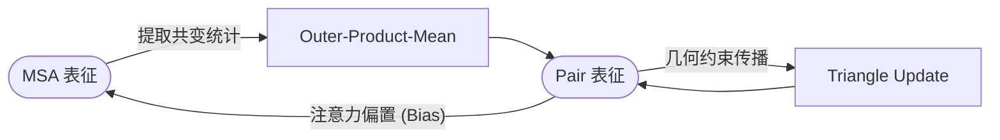

---
{"publish":true,"created":"2025-12-14T21:47:21.000+08:00","modified":"2025-12-29T12:00:04.513+08:00","cssclasses":""}
---


# [fold.it](fold.it) ：如何把进化信息变成几何结构？

在若干年前，研究人员曾尝试把蛋白质折叠变成一个游戏 —— Foldit。
玩家并不需要掌握量子化学，只需要拖拽、旋转、拉近、推开，就能让屏幕上蛋白结构的能量读数下降。令人惊讶的是，人类玩家常常能凭直觉找到比当时自动化算法更合理的构象。

这一点揭示了一个朴素但深刻的事实：

> 蛋白结构蕴含着高度直观的几何逻辑，而构象的“合理性”往往是可以被视觉捕捉的拓扑特征。

这也是蛋白质结构预测长期被称为计算生物学“圣杯问题”的原因：目标明确、物理法则已知，但计算复杂度却令人望而却步。

---

## 早期尝试：能量最小化和contact map

结构预测最初的愿望非常符合物理直觉：寻找自由能最低的构象。

### 能量最低假设

既然天然结构由物理相互作用决定，那么理论上我们只需要模拟原子间的范德华力、静电作用等，并在Energy Landscape中搜索全局极小值。但现实困难在于：

* 搜索空间爆炸：随着链长增加，可能构象呈指数级增长（Levinthal's paradox）。
* 粗粒化精度不足：现有的力场参数难以完美模拟复杂的原子环境。

于是，研究界退而求其次，试图解决一个简化版问题：如果能知道哪些残基靠得很近，也许就能重建出整体蛋白结构。

### Contact Map：三维问题的二维化

我们将三维结构坍缩为一个 $L \times L$ 的二值矩阵：

$$
C_{ij} = \begin{cases} 1 & \text{if } \text{dist}(i,j) < 8\mathring{A} \\ 0 & \text{otherwise} \end{cases}
$$

这种方法的局限性显而易见：接触图（Contact Map）极其稀疏，且丢失了具体的距离与方向信息。为了填补这些空白，人们开始将目光转向大自然留下的遗产 —— 同源序列的共变信号。

---

## 统计学的介入：从互信息到全局耦合

如果残基 $i$ 和残基 $j$ 在三维空间中接触，它们往往会发生协同进化（Co-evolution）：当 $i$ 突变为带正电的氨基酸时，$j$ 为了保持结构稳定，可能会突变为带负电的氨基酸。

### 最朴素的共变：互信息 (Mutual Information)

最简单的想法是计算两列氨基酸分布的相关性：

$$
\text{MI}(i,j) = \sum_{a,b} P_{ij}(a,b) \log \frac{P_{ij}(a,b)}{P_i(a)P_j(b)}
$$

这种方法虽然直观，但存在一个严重的传递性噪声问题：

> [!FAILURE] 传递性误判
> 如果 $i$ 与 $k$ 接触，$k$ 与 $j$ 接触，那么 $i$ 和 $j$ 在统计上也会表现出高度相关（$i \leftrightarrow k \leftrightarrow j$）。
> MI 无法区分这种“间接相关”与“直接物理接触”，导致预测出的接触图充满了假阳性噪声。


### 第一次突破：DCA (Direct Coupling Analysis)

为了剥离间接影响，DCA 引入了统计物理中的 Potts 模型。它假设观察到的序列分布 $P(\mathbf{x})$ 服从玻尔兹曼分布：

$$
P(\mathbf{x}) = \frac{1}{Z} \exp\left( \sum_{i<j} J_{ij}(x_i, x_j) + \sum_i h_i(x_i) \right)
$$

其中耦合矩阵 $J_{ij}$ 才是我们真正想要的“直接相互作用”。通过对这个Inverse Ising Model进行求解，DCA 成功地从噪声中提取出了高置信度的接触点。

但即便有了 DCA，我们依然面临一个无法回避的几何难题。

---

## 几何一致性

早期的共变方法给出的只是碎片化的约束。问题在于：并非任意一个 Pairwise 矩阵都能被还原为三维结构。

一个合法的距离矩阵必须满足欧氏几何公理，最典型的就是三角不等式：

$$
d(i,j) \le d(i,k) + d(k,j)
$$

> [!NOTE] Contact 和 空间真实距离的矛盾
> 仅靠统计学预测出的 Contact Map 往往充满了几何上的自相矛盾。
> 结构预测的难点不仅仅是“找到足够多的联系”，而是“如何让这些联系在几何上彼此兼容”。

AlphaFold2  的核心贡献，正是设计了一套机制，将无结构的统计共变信号，一步步“平滑”为几何自洽的场。

---

## AlphaFold2

AF2 没有直接预测坐标，而是花费了绝大部分算力在 Pair Representation（配对表征）的优化上。

### Outer-Product-Mean：从MSA到三维空间contact

Evoformer 首先通过外积均值，将一维的 MSA 序列信息“提升”到二维的 Pair 空间：

$$
\text{pair}_{ij} = \frac{1}{N}\sum_{s=1}^N \mathbf{E}_{s,i} \otimes \mathbf{E}_{s,j}
$$

这一步相当于显式地告诉网络：“请关注这两列氨基酸在演化历史上的联合分布模式”。

### Triangle Update：强制几何自洽

这是 AF2 中最精彩的设计。它对 Pair 矩阵中的所有三元组 $(i, j, k)$ 进行消息传递：

$$
\text{pair}_{ij} \leftarrow \text{pair}_{ij} + \text{LayerNorm}(\text{pair}_{ik} \cdot \text{pair}_{kj})
$$

其直观物理含义是：
如果 $i$ 靠近 $k$，且 $k$ 靠近 $j$，那么 $i$ 和 $j$ 的关系必然受到约束，不能随意取值。

通过多层堆叠这种更新，网络实际上是在不断“修复”Pair 矩阵，使其逐渐满足三角不等式，逼近一个真实的三维距离场。



### Structure Module：从场到坐标

经过多轮 Triangle Update 后，Pair 表征已经包含了一个“在几何上几乎自洽”的距离图。Structure Module 的任务仅仅是将这个隐式的几何场“解码”为具体的三维坐标 $(x, y, z)$。

## 演示代码

```python
import torch
import torch.nn as nn
import torch.nn.functional as F
import math

class SimpleSelfAttention(nn.Module):
    def __init__(self, d):
        super().__init__()
        self.q = nn.Linear(d, d)
        self.k = nn.Linear(d, d)
        self.v = nn.Linear(d, d)

    def forward(self, x, bias=None):
        L, d = x.shape
        q = self.q(x)
        k = self.k(x)
        v = self.v(x)

        logits = q @ k.T / math.sqrt(d)
        if bias is not None:
            # 将 Pair 信息作为 Bias 注入 MSA 注意力图
            logits = logits + bias

        attn = F.softmax(logits, dim=-1)
        out = attn @ v
        return out

class MiniEvoformerBlock(nn.Module):
    def __init__(self, d_msa=4, d_pair=3):
        super().__init__()
        self.msa_col_attn = SimpleSelfAttention(d_msa)
        self.pair_to_bias = nn.Linear(d_pair, 1)
        self.msa_outer_proj = nn.Linear(d_msa*d_msa, d_pair)
        self.tri_proj = nn.Linear(d_pair, d_pair)

    def msa_to_pair_outer(self, msa):
        # 模拟 Outer-Product-Mean
        n_seq, L, d = msa.shape
        msa_mean = msa.mean(dim=0)
        out = torch.zeros(L, L, d*d)

        for i in range(L):
            for j in range(L):
                out[i,j] = torch.ger(msa_mean[i], msa_mean[j]).reshape(-1)

        return self.msa_outer_proj(out)

    def triangle_multiply(self, pair):
        # 模拟 Triangle Multiplicative Update
        L, _, d = pair.shape
        new_pair = torch.zeros_like(pair)
        pair_proj = self.tri_proj(pair)

        # 简单的 O(L^3) 循环演示三元组更新
        for i in range(L):
            for j in range(L):
                acc = 0.0
                for k in range(L):
                    acc = acc + pair[i,k] * pair_proj[k,j]
                new_pair[i,j] = acc
        return new_pair

    def forward(self, msa, pair):
        n_seq, L, d = msa.shape
        # 1. Pair 影响 MSA: 生成 Bias
        bias = self.pair_to_bias(pair).squeeze(-1)

        # 2. 更新 MSA
        msa_list = []
        for s in range(n_seq):
            msa_list.append(self.msa_col_attn(msa[s], bias=bias))
        msa = torch.stack(msa_list, dim=0)

        # 3. MSA 影响 Pair: 外积均值
        delta = self.msa_to_pair_outer(msa)
        pair = pair + delta

        # 4. Pair 自我更新: 三角乘法
        pair = pair + self.triangle_multiply(pair)

        return msa, pair

# Example usage
torch.manual_seed(42)
msa = torch.randn(6, 6, 4)  # (Sequences, Length, Dim)
pair = torch.zeros(6, 6, 3) # (Length, Length, Dim)
block = MiniEvoformerBlock()

msa_out, pair_out = block(msa, pair)

print(f"Input MSA shape: {msa.shape}")
print(f"Output Pair shape: {pair_out.shape}")
```

## 评价指标

### RMSD

衡量两个刚体结构相似性最直观的方法是计算均方根偏差（RMSD），但在实际应用中，RMSD 对离群点极其敏感。对于一个由几百个氨基酸组成的蛋白质，即便核心折叠完全正确，只要有一段末端无序区域（Loop）发生了大幅度的摆动，就会导致整体 RMSD 数值激增，从而掩盖了核心结构预测准确的事实。

### GDT-TS

GDT-TS（Global Distance Test Total Score）的本质是一种去除长度依赖性和离群点干扰的刚性重叠算法。它不再追求所有原子的最小距离和，而是计算在不同距离阈值下，能够成功对齐的 Cα 原子对的比例。具体而言，GDT-TS 考察在 1Å、2Å、4Å 和 8Å 这四个截断值下，预测结构中有多少比例的残基能与真实结构中的对应残基重合。这四个比例的平均值构成了最终分数。这种多尺度的阈值设计使得 GDT-TS 既能奖励高精度的核心区重叠，又能包容柔性区域的合理偏差。

>[!INFO] 
>GDT-TS 的计算逻辑 GDT_TS=(P1​+P2​+P4​+P8​)/4 其中 Pd​ 代表在距离阈值 d（单位：埃）下，预测结构与参考结构经过刚体叠加后，距离小于 d 的 Cα 原子对所占的百分比。这种算法通过分级截断，有效地剥离了柔性末端对整体评分的非线性影响。

### pLDDT

pLDDT（Predicted Local Distance Difference Test）反映了模型对自身预测结果的确定性程度。pLDDT 分数越高，意味着模型对该区域的侧链朝向和骨架走向越有信心。通常 pLDDT > 90 被认为具有极高的可信度，适合用于细致的侧链分析；而 pLDDT < 50 则往往对应着蛋白质本身就是固有无序区（IDR）

> [!NOTE] 
> pLDDT 虽然是逐残基的局部评分，但它聚合后往往能反映整体质量。然而，高 pLDDT 并不保证结构在全局空间位置上的绝对正确（例如结构域之间的相对取向可能错误），它仅保证了局部原子堆积的紧密性和合理性。

### 是否物理自洽

检查键长、键角以及二面角是否处于允许的范围内。最为经典的工具是拉氏图（Ramachandran Plot），它展示了蛋白质骨架中 ϕ（Phi）和 ψ（Psi）二面角的分布情况。由于原子半径的位阻效应，氨基酸残基只能存在于特定的构象空间内（如 α 螺旋区和 β 折叠区）。如果预测结构中有大量残基落入拉氏图的“禁阻区”，或者出现了非物理的键长拉伸（例如 Cα−Cα 距离异常），说明模型仅仅是在拟合几何形状，而没有学习到潜在的物理能量面。

对于高质量的预测结构，我们要求其键长和键角的偏差应接近于高分辨率晶体结构的统计分布，且侧链的旋转异构体（Rotamer）也应符合统计学规律。

## 小结

当我们回顾从 Mutual Information 到 AlphaFold2 的历程，是对信息形态理解的深化：
- Mutual Information：看到了共变的影子，但受困于噪声。
- DCA：通过统计物理模型，成功分离了直接与间接作用，得到了稀疏的拓扑连接。
- AlphaFold2：通过 Triangle Update 等机制，强制让离散的共变信号服从欧氏空间的几何约束，最终构建出连续的三维流形。
    
> [!INFO] 
> 进化的统计学本质 MSA 不仅仅是生物进化的历史记录，它事实上包含了对“存在的蛋白质空间”的一种高维统计压缩。AF2 证明了我们就能通过几何约束将其还原为物理实体。


> [!NOTE] 思考
> 类似这种分子进化信息还能用于解决那些生物学问题? 是否有着更加高效的架构能够适合于生物学问题建模?